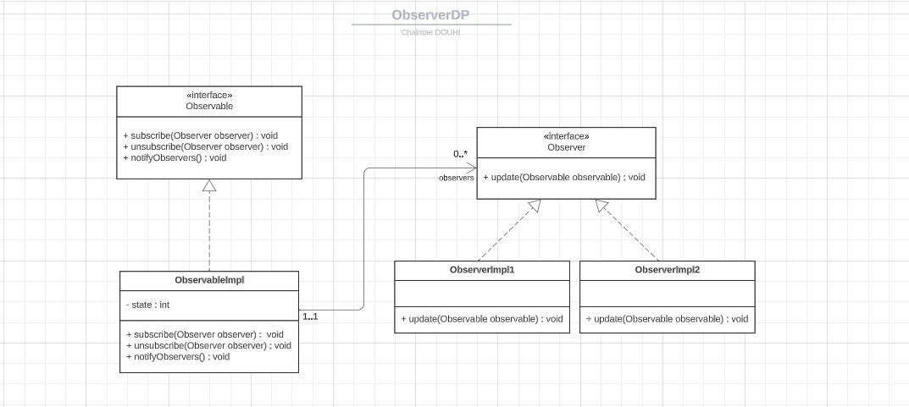

## Observer Pattern
### Description
The observer pattern is a software design pattern in which an object, called the subject, maintains a list of its dependents, called observers, and notifies them automatically of any state changes, usually by calling one of their methods.

### Class Diagram


### Push and Pull methods
* Push method : The subject sends observers detailed information about the change, whether they need it or not.
* Pull method : The subject sends observers minimal information about the change, and observers ask for details explicitly thereafter.

### Observable : Subject
```java
public interface Observable {
    void subscribe(Observer observer);
    void unsubscribe(Observer observer);
    void notifyObservers();
}
```

### Concrete Observable 
This is the class that implements the Observable interface. It has a state and a list of observers. It also has methods to subscribe, unsubscribe and notify observers. The notifyObservers method is called whenever the state changes. The observers are notified by calling their update method.
```java
public class ObservableImpl implements Observable {
    private int state = 1;
    private List<Observer> observers = new ArrayList<>();

    @Override
    public void subscribe(Observer observer) {
        this.observers.add(observer);
    }

    @Override
    public void unsubscribe(Observer observer) {
        this.observers.remove(observer);
    }

    @Override
    public void notifyObservers() {
        for (Observer observer : observers) {
            observer.update(this);
        }
    }

    public void setState(int state) {
        this.state = state;
        this.notifyObservers();
    }

    public int getState() {
        return this.state;
    }

}
```

### Observer
This is the interface that all observers must implement

```java
public interface Observer {
    void update(Observable observable);
}
```

### Concrete Observer
* ObserverImpl1
```java
public class ObserverImpl1 implements Observer {
    @Override
    public void update(Observable observable) {
        int state = ((ObservableImpl)observable).getState();
        double res = state * state + 9;
        System.out.println("ObserverImpl1 ...");
        System.out.println("New state = " + state);
        System.out.println("Result : " + res);
    }
}
```

* ObserverImpl2
```java
public class ObserverImpl2 implements Observer {
    private int counter;

    @Override
    public void update(Observable observable) {
        int state = ((ObservableImpl)observable).getState();
        if (state % 2 == 0) ++counter;
        System.out.println("ObserverImpl2 ...");
        System.out.println("Updated state = " + state);
        System.out.println("Result : " + ((state % 2) == 0 ? "Even" : "Odd"));
        System.out.println("Counter : " + counter);
    }
}
```

### Conclusion
The observer pattern is a software design pattern in which an object, called the subject, maintains a list of its dependents, called observers, and notifies them automatically of any state changes, usually by calling one of their methods.


